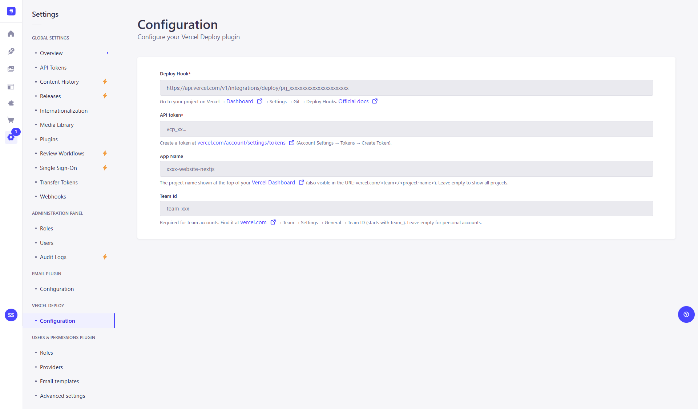
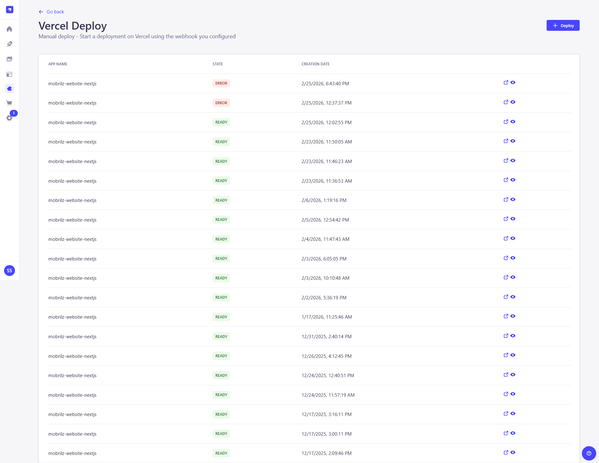

# strapi-plugin-vercel-deploy

[](https://www.npmjs.com/package/@nomadprogrammer/strapi-plugin-vercel-deploy)
[](https://www.npmjs.com/package/@nomadprogrammer/strapi-plugin-vercel-deploy)
[](https://github.com/ProgrammerNomad/strapi-plugin-vercel-deploy/blob/main/LICENSE)
[](https://github.com/ProgrammerNomad/strapi-plugin-vercel-deploy/stargazers)
[](https://github.com/ProgrammerNomad/strapi-plugin-vercel-deploy/issues)
[](https://strapi.io)
[](https://nodejs.org)

Strapi v5 plugin to trigger and monitor Vercel deployments directly from the Strapi admin panel.

---

## Features

- Trigger a new Vercel deployment with one click
- View live deployment status with automatic polling
- Color-coded badges: READY (green), ERROR / CANCELED (red), BUILDING / QUEUED (orange)
- Direct links to deployment URL and Vercel Inspector
- Settings page shows current configuration

---

## Screenshots

**Dashboard**



**Deployment Status**



---

## Installation

```bash
npm install @nomadprogrammer/strapi-plugin-vercel-deploy
```

Register in `config/plugins.js`:

```js
module.exports = ({ env }) => ({
  'vercel-deploy': {
    enabled: true,
    config: {
      deployHook:  env('VERCEL_DEPLOY_PLUGIN_HOOK'),
      apiToken:    env('VERCEL_DEPLOY_PLUGIN_API_TOKEN'),
      appFilter:   env('VERCEL_DEPLOY_PLUGIN_APP_FILTER', ''),
      teamFilter:  env('VERCEL_DEPLOY_PLUGIN_TEAM_FILTER', ''),
      roles:       env.array('VERCEL_DEPLOY_PLUGIN_ROLES', []),
    },
  },
});
```

---

## Environment Variables

Add these to your Strapi project's `.env` file:

```env
# Required
VERCEL_DEPLOY_PLUGIN_HOOK=https://api.vercel.com/v1/integrations/deploy/prj_xxx/yyy
VERCEL_DEPLOY_PLUGIN_API_TOKEN=your_vercel_api_token_here

# Optional
VERCEL_DEPLOY_PLUGIN_APP_FILTER=my-nextjs-app
VERCEL_DEPLOY_PLUGIN_TEAM_FILTER=team_xxxxxxxxxxxxxxxxxxxx
VERCEL_DEPLOY_PLUGIN_ROLES=strapi-super-admin
```

| Variable                          | Required | Description                                      |
|-----------------------------------|----------|--------------------------------------------------|
| `VERCEL_DEPLOY_PLUGIN_HOOK`       | Yes      | Deploy Hook URL from Vercel project settings     |
| `VERCEL_DEPLOY_PLUGIN_API_TOKEN`  | Yes      | Vercel API token to list deployments             |
| `VERCEL_DEPLOY_PLUGIN_APP_FILTER` | No       | Filter deployments by project name               |
| `VERCEL_DEPLOY_PLUGIN_TEAM_FILTER`| No       | Team ID — required for Vercel team accounts      |
| `VERCEL_DEPLOY_PLUGIN_ROLES`      | No       | Strapi roles allowed to use the plugin           |

---

## Getting Your Vercel Credentials

### 1. Deploy Hook URL _(required — to trigger deployments)_

A Deploy Hook is a unique URL that triggers a new build when called. Keep it secret — anyone with the URL can trigger a deployment.

1. Open your project on [vercel.com/dashboard](https://vercel.com/dashboard).
2. Click **Settings** → **Git** → scroll to **Deploy Hooks**.
3. Enter a name (e.g. `Strapi CMS`) and select the branch (e.g. `main`).
4. Click **Create Hook** and copy the generated URL.
5. Set it as `VERCEL_DEPLOY_PLUGIN_HOOK` in your `.env`.

> Requires your project to be connected to a Git repository.
> Official docs: [vercel.com/docs/deploy-hooks](https://vercel.com/docs/deploy-hooks)

---

### 2. Vercel API Token _(required — to list deployments)_

1. Go to [vercel.com/account/settings/tokens](https://vercel.com/account/settings/tokens).
2. Fill in **TOKEN NAME**, set **SCOPE** to your team (or Full Account for personal), set **EXPIRATION** (recommended: `No Expiration`).
3. Click **Create** and **copy the token immediately** — it is only shown once.
4. Set it as `VERCEL_DEPLOY_PLUGIN_API_TOKEN` in your `.env`.

> Official docs: [vercel.com/docs/rest-api#authentication](https://vercel.com/docs/rest-api#authentication)

---

### 3. App Name _(optional — filter by project)_

The project name shown at the top of your Vercel dashboard (also visible in the URL: `vercel.com/<team>/<project-name>`).  
Set as `VERCEL_DEPLOY_PLUGIN_APP_FILTER`. Leave empty to show all projects.

---

### 4. Team ID _(required for team accounts)_

1. Go to your team on [vercel.com/dashboard](https://vercel.com/dashboard).
2. Click **Settings** → **General**.
3. Copy the **Team ID** (starts with `team_`).
4. Set as `VERCEL_DEPLOY_PLUGIN_TEAM_FILTER`. Leave empty for personal accounts.

---

## Quick Reference

| Value             | Where to find it                                              |
|-------------------|---------------------------------------------------------------|
| Deploy Hook URL   | Project → Settings → Git → Deploy Hooks                      |
| API Token         | [vercel.com/account/settings/tokens](https://vercel.com/account/settings/tokens) |
| App / Project Name| Dashboard → your project name (also in the URL)              |
| Team ID           | Team → Settings → General → Team ID (starts with `team_`)   |


---

## Contributing

Found a bug or want to improve the plugin? Contributions are welcome!

- **Bug reports / feature requests:** [Open an issue](https://github.com/ProgrammerNomad/strapi-plugin-vercel-deploy/issues)
- **Pull requests:** Fork the repo, make your changes, and open a PR against `main`
- **Developer setup guide:** See [docs/DEVELOPMENT.md](./docs/DEVELOPMENT.md) for local setup, build workflow, and project structure

---

## Links

- **npm:** [npmjs.com/package/@nomadprogrammer/strapi-plugin-vercel-deploy](https://www.npmjs.com/package/@nomadprogrammer/strapi-plugin-vercel-deploy)
- **GitHub:** [github.com/ProgrammerNomad/strapi-plugin-vercel-deploy](https://github.com/ProgrammerNomad/strapi-plugin-vercel-deploy)
- **Author:** [github.com/ProgrammerNomad](https://github.com/ProgrammerNomad/)
- **Issues / PRs:** [github.com/ProgrammerNomad/strapi-plugin-vercel-deploy/issues](https://github.com/ProgrammerNomad/strapi-plugin-vercel-deploy/issues)

---

## License

MIT © [ProgrammerNomad](https://github.com/ProgrammerNomad/)
